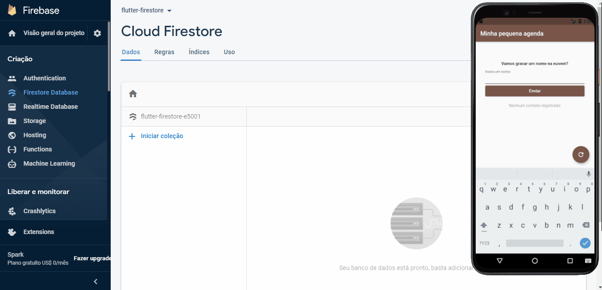

# Alura+ - Flutter com Cloud Firestore do Firebase

Projeto desenvolvido para gravação do Alura+ sobre integração e uso do Banco de Dados na Nuvem Firestore com uma aplicação Flutter.

## Funcionamento


Trata-se de um simples projeto onde armazenamos na nuvem nomes adicionados via um campo de texto, e exibimo-os na tela em forma de lista, coletando essa informação direto da nuvem.

## Uso do Repositório
Para ter acesso ao projeto completo, basta baixar o arquivo .zip ou dar um clone no repositório:

```
git clone https://github.com/ricarthlima/flutter-firestore.git
```

Caso queira começar do ponto onde o Alura+ começa (para treino), fazer um checkout para a branch `to_alura+`.

```
git clone https://github.com/ricarthlima/flutter-firestore.git
git checkout to_alura+
```
